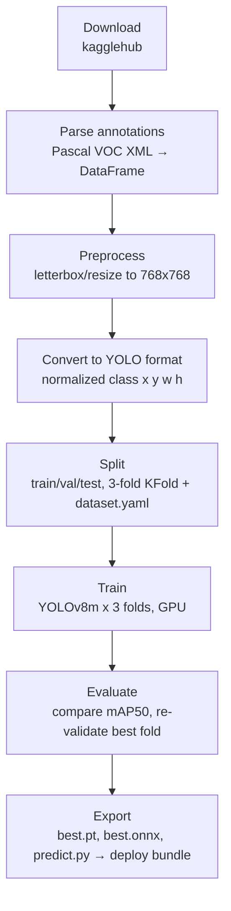

# PCB Defect Detection

Object detection pipeline that trains a YOLOv8 model to localize and classify manufacturing defects on printed circuit boards (PCBs).

## Dataset

Public synthetic PCB dataset ([akhatova/pcb-defects](https://www.kaggle.com/datasets/akhatova/pcb-defects) on Kaggle) containing 1386 images across 6 defect classes, with Pascal VOC (XML) bounding-box annotations:

- Missing hole
- Mouse bite
- Open circuit
- Short
- Spur
- Spurious copper

## Architecture / Pipeline

The full pipeline lives in [index.ipynb](index.ipynb) and runs end to end as follows:



1. **Download** — dataset pulled via `kagglehub`.
2. **Parse annotations** — Pascal VOC XML files are parsed into a single pandas DataFrame (`filename`, `class`, bounding box).
3. **Preprocess** — images are letterboxed/resized to 768x768 (aspect ratio preserved, padded), and annotations are rescaled to match.
4. **Convert to YOLO format** — bounding boxes are converted to normalized `class x_center y_center width height` label files.
5. **Split** — images/labels are split into train/val/test sets, then regrouped into 3 stratified folds using `KFold` for cross-validation, each with a generated `dataset.yaml`.
6. **Train** — a YOLOv8m model (`ultralytics`) is trained per fold on GPU with tuned hyperparameters (custom augmentation: mosaic, RandAugment, HSV jitter, copy-paste, etc.), tracking box/class/DFL loss curves.
7. **Evaluate** — folds are compared by `mAP50`; the best fold is re-validated with `.val()` to get precision, recall, mAP50, and mAP50-95 on its held-out split.
8. **Export** — the best fold's weights are exported into a self-contained deploy bundle: `best.pt`, `best.onnx` (via `onnx`/`onnxslim`), `classes.txt`, a standalone `predict.py` CPU-inference script, and a bundle `README.txt`, zipped for portability to another machine.

## Tech Stack

- **Model**: [Ultralytics YOLOv8](https://github.com/ultralytics/ultralytics) (`yolov8m`), PyTorch
- **Data handling**: pandas, NumPy, OpenCV, PyYAML
- **Validation**: scikit-learn (`KFold`)
- **Dataset access**: kagglehub
- **Visualization**: Matplotlib
- **Export/inference**: ONNX, ONNX Runtime, onnxslim
- **Environment/tooling**: Python 3.11–3.12, [uv](https://docs.astral.sh/uv/) for dependency management, Jupyter (via `ipykernel`)
- **PyTorch index**: CUDA 12.8 wheels (`pytorch-cu128`) for GPU training

## Project Structure

```
.
├── index.ipynb      # full pipeline: preprocessing, training, evaluation, export
├── main.py           # placeholder entrypoint
├── pyproject.toml    # dependencies (managed with uv)
└── working/           # generated at runtime (gitignored)
    ├── images_resized/     # letterboxed 768x768 images
    ├── output/              # YOLO-format images/labels + k-fold splits
    └── deploy/               # exported best.pt / best.onnx / predict.py bundle
```

`working/`, `runs/`, model weights (`*.pt`, `*.onnx`), and archives (`*.zip`, `*.7z`) are gitignored since they're large, regenerable build artifacts.

## Setup

```bash
uv sync
```

Requires a Kaggle account/API credentials for `kagglehub` to download the dataset, and a CUDA-capable GPU for training at the configured batch size/image size (768px, YOLOv8m).

## Usage

Run [index.ipynb](index.ipynb) top to bottom. It will:

1. Download and preprocess the dataset into `working/`.
2. Train 3 cross-validation folds (`epochs=180`, `imgsz=768`, `batch=8`).
3. Evaluate folds and pick the best one.
4. Produce a portable deploy bundle at `working/deploy/`.

### Running inference with the exported bundle

On any machine (no training code needed):

```bash
pip install ultralytics onnxruntime
python predict.py path/to/image.jpg
```

This loads `best.onnx` and prints detected defects with confidence scores, saving an annotated `prediction.jpg`.
